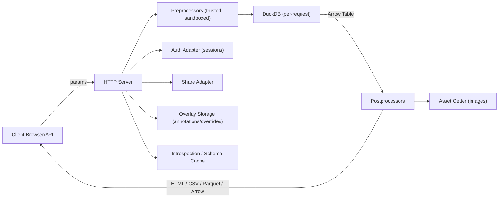
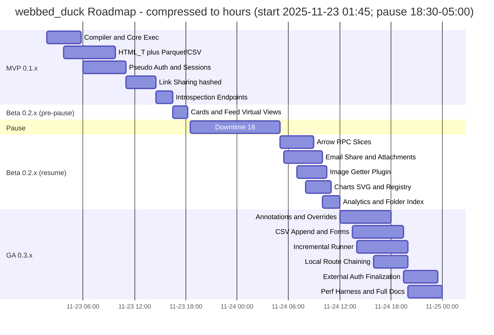

# AGENTS.md v2

## Project: `webbed_duck`

### A Parameterized SQL Web Server for DuckDB, built for Intranets — **securable** by design

> `webbed_duck` converts Markdown+SQL route files into fast, auditable, intranet-friendly APIs and HTML views backed by DuckDB and Apache Arrow.
> It is **securable** (not “secure”): designed for trusted networks with clear, modular hardening paths (proxy TLS, external auth, token binding, PII redaction).
> This document is the master guide for human/AI maintainers: architecture, compiler, plugins, testing, security posture, DX, and progress trackers.

---

## 0) Contents

* [1) Philosophy & Invariants](#1-philosophy--invariants)
* [2) Architecture & Data Flow](#2-architecture--data-flow)
* [3) Repository Layout & Storage Roots](#3-repository-layout--storage-roots)
* [4) Configuration Surface](#4-configuration-surface)
* [4.5) Design Doctrine (Arjan Codes-inspired)](#45-design-doctrine-arjan-codes-inspired)
* [5) Route Compiler (TOML/SQL sidecars → Python)](#5-route-compiler-tomlsql-sidecars--python)
* [6) Request Lifecycle](#6-request-lifecycle)
* [7) DuckDB & Arrow Rules](#7-duckdb--arrow-rules)
* [8) Route Types (Static / Parametric / Virtual Views)](#8-route-types-static--parametric--virtual-views)
* [9) Parameters, Types, Guards & Preprocessors](#9-parameters-types-guards--preprocessors)
* [10) Postprocessors (HTML_T, HTML_C, Feed, Arrow RPC, Charts)](#10-postprocessors-html_t-html_c-feed-arrow-rpc-charts)
* [11) Static Asset Plug-in (Image Getter)](#11-static-asset-plug-in-image-getter)
* [12) Annotations, Tasks & Overrides (Overlay)](#12-annotations-tasks--overrides-overlay)
* [13) Sharing (Links + Email: Inline/Attachments)](#13-sharing-links--email-inlineattachments)
* [14) Auth & Sessions (Pseudo/Basic/External)](#14-auth--sessions-pseudobasicexternal)
* [15) Transport (HTTP-first; TLS via Proxy)](#15-transport-http-first-tls-via-proxy)
* [16) Incremental & Orchestrated Routes](#16-incremental--orchestrated-routes)
* [17) Internal API Chaining (“local:” routes)](#17-internal-api-chaining-local-routes)
* [18) Introspection, Auto-Forms & Static Pages](#18-introspection-auto-forms--static-pages)
* [19) Popularity Analytics & Folder Indexes](#19-popularity-analytics--folder-indexes)
* [20) Error Taxonomy & Mapping](#20-error-taxonomy--mapping)
* [21) Plugin Lifecycle & Extension Points](#21-plugin-lifecycle--extension-points)
* [22) CLI & Developer Experience](#22-cli--developer-experience)
* [23) Testing Strategy & Coverage](#23-testing-strategy--coverage)
* [24) Performance Notes & Limits](#24-performance-notes--limits)
* [25) Progress Trackers (Checklists & Mermaid Gantt)](#25-progress-trackers-checklists--mermaid-gantt)
* [26) Release, Versioning & Deprecations](#26-release-versioning--deprecations)
* [27) Appendices (Config, Examples, Snippets)](#27-appendices-config-examples-snippets)

### Maintainer Log — 2025-03-10

* Re-centered the Arjan/Ports doctrine with explicit port tables, added refactor cues, and reverted unintended test/runtime edits from the prior sweep.

### Maintainer Log — 2025-03-07

* Documentation sweep: codified Arjan-inspired design doctrine, refreshed compiler guidance for TOML/SQL sidecars, and tightened testing/performance expectations.

### Maintainer Log — 2025-03-05

* 0.4 release prepped with auto-compiling `serve`, live route reload support, watch-mode CLI flags, and a refreshed quick start/README to highlight the zero-boilerplate workflow.

### Maintainer Log — 2025-02-28

* 0.3 release finalized: docs aligned with compiled route behavior, optional dependencies documented, and storage layout captured for maintainers.
* Verified that pseudo-share, overlay, and analytics flows are fully covered by the existing pytest suite (25 passing locally).
* Packaging metadata now matches runtime expectations—no outstanding follow-up tasks for this milestone.

### Maintainer Log — 2025-02-20

* Documentation sweep: README, changelog, and MVP 0.3 status report now reference DuckDB-backed checkpoints, `/shares` endpoints, and pseudo-auth/share token hashing.
* Reiterated optional `pyzipper` dependency – code paths tolerate its absence but `pyproject.toml` still lists it, so packaging decisions should weigh that tension.

### Maintainer Log — 2025-02-14

* Completed compiler/runtime handling for `@meta`, `@params`, `@preprocess`, `@postprocess`, `@charts`, and `@assets` directives. Added integration tests covering directive parsing, preprocess execution, and analytics folder aggregation.
* Implemented preprocess runner with callable resolution safety checks plus unit tests (`tests/test_preprocess.py`). Local runner respects preprocess output.
* Upgraded share workflow to produce inline watermarked snapshots, CSV/Parquet/HTML attachments with ZIP support and redaction metadata; added regression coverage in `tests/test_pseudo_share.py`.
* Expanded analytics to track hits/rows/latency/interactions with folder-aware summaries; verified via `/routes` tests.
* Error taxonomy now emits category-specific statuses; incremental runner persists progress in `runtime/checkpoints.duckdb`.
* All new behavior covered by `pytest` (25 passed).

---

## 1) Philosophy & Invariants

**Securable, not “secure”.** Default for intranets; provide guardrails and easy hardening.
**Predictable.** One DuckDB connection per request; no global cursors.
**Auditable.** Per-request IDs, redacted params, elapsed, rows, route/version.
**Static-first.** Production serves **compiled** routes from `routes_build/` (no decorators in prod).
**Arrow everywhere.** In-memory interchange is Arrow Tables or Streams only.

**Never violate:**

* Do not share DuckDB connections across requests/threads.
* Do not execute untrusted code. Route preprocessors are repo-managed, trusted artifacts.
* Do not persist plaintext tokens/passwords; share tokens stored hashed.
* Do not allow path traversal/symlink escape from `storage_root`.

---

## 2) Architecture & Data Flow



**Storage root** (all internal paths derive from here):

```
storage_root/
  routes_build/            # compiled modules
  cache/                   # materialized artifacts (parquet/csv/html)
  schemas/                 # Arrow schemas (json)
  static/                  # system_theme.css/js, localized images
  runtime/
    meta.sqlite3           # sessions, shares, analytics (ref adapter)
    checkpoints.duckdb     # incremental progress (optional)
    auth.duckdb            # pseudo/basic auth (ref adapter)
```

---

## 3) Repository Layout & Storage Roots

```
webbed_duck/
  core/                    # DuckDB + Arrow + config + schema cache
  server/                  # HTTP app, routing, middleware
  plugins/                 # postprocessors, charts, assets, share adapters
  routes_src/              # TOML + SQL sidecar sources
  routes_build/            # compiled *.py (prod source of truth)
  examples/                # emailer, share rendering, sample routes
  tests/                   # pytest suites
  config.toml              # runtime config (env override)
  pyproject.toml           # packaging
```

**Shared DBs across requests = SQLite** (sessions/shares/analytics/overlays).
**Query execution = per-request DuckDB**; file artifacts via DuckDB writers.

---

## 4) Configuration Surface

```toml
[server]
storage_root = "./storage"

[transport]
mode = "insecure_http"                # or "tls_terminated_proxy"
trusted_proxy_nets = ["127.0.0.1/32","10.0.0.0/8"]

[ui]
show_http_warning = true              # admins/devs may hide

[auth]
mode = "pseudo"                       # none | pseudo | basic_pseudo | external
allowed_domains = ["example.local"]
session_ttl_minutes = 45
remember_me_days = 14
cookie_name = "duckserv_sid"

[email]
adapter = "custom:examples.emailer.send_email"
share_token_ttl_minutes = 90
bind_share_to_user_agent = false
bind_share_to_ip_prefix = false

[share]
max_total_size_mb = 15
zip_attachments = true
zip_passphrase_required = false
watermark = true

[cache]
ttl_hours = 24                        # default; routes can override “forever”

[analytics]
enabled = true
weight_interactions = 3

[feature_flags]
annotations_enabled = true
comments_enabled = true
tasks_enabled = true
overrides_enabled = true

[assets]
default_image_getter = "static_fallback_getter"  # overridable per route
```

---

### 4.5) Design Doctrine (Arjan Codes-inspired)

* **SOLID for Python** ([Arjan Codes blog](https://arjancodes.com/blog/solid-principles-in-python-programming/), [Arjan Codes channel](https://www.youtube.com/arjancodes))
  * *Single Responsibility*: compiler, executor, cache, overlay, and auth each own one reason to change.
  * *Open/Closed*: extend behavior via registries/adapters (charts, postprocessors, assets, auth, storage) instead of type switches.
  * *Liskov & Interface Segregation*: expose small `typing.Protocol` contracts; adapters must keep promises about return types and side effects.
  * *Dependency Inversion*: high-level flows (`serve`, `run_route`, cache service) depend on ports, not concrete libraries.
* **Ports & Adapters (Hexagonal)** ([Cockburn](https://alistair.cockburn.us/hexagonal-architecture/), [AWS summary](https://docs.aws.amazon.com/prescriptive-guidance/latest/cloud-design-patterns/hexagonal-architecture.html), [Python case study](https://douwevandermeij.medium.com/hexagonal-architecture-in-python-7468c2606b63))
  * Core stays pure; I/O happens at the edges through narrow ports.
  * Adapters register via protocols; no direct imports from core to plugin implementations.

  | Port (protocol) | Purpose | Default adapters |
  | --- | --- | --- |
  | `StorageAdapter` | Persist cache/overlay artifacts | `plugins.storage.local_storage`
  | `AuthAdapter` | Authenticate/authorize requests | `plugins.auth.pseudo`, `plugins.auth.external` |
  | `EmailAdapter` | Deliver share payloads | `plugins.email.smtp`
  | `ImageGetter` | Resolve asset URLs | `plugins.assets`
  | `ChartRenderer` | Render charts/visualizations | `plugins.charts`
  | `Postprocessor` | Format outputs (HTML/Feed/Arrow) | `plugins.postprocess`

  * Core depends only on ports; adapters depend on core; wiring happens at startup via registries.
* **Types & DTOs**
  * Prefer `Protocol` + `@runtime_checkable` for ports; use `dataclasses` for immutable route metadata, schema details, and share options.
* **Composition over inheritance**
  * Wire behavior by composing adapters/utilities; reserve inheritance for sealed error families and simple mixins.
* **Performance by design**
  * Push work into DuckDB and Arrow; avoid Python loops; track regressions with `pytest-benchmark` in CI ([docs](https://pytest-benchmark.readthedocs.io/)).
* **Simplicity & cleanliness**
  * Keep functions short and direct; prune dead code with `vulture`; watch cyclomatic complexity budgets with `radon` ([project](https://github.com/jendrikseipp/vulture)).
* **Refactor toolkit** ([ArjanCodes/betterpython](https://github.com/ArjanCodes/betterpython))
  * Replace long `if/elif` ladders with registries.
  * Extract adapters when behavior touches I/O or external systems.
  * Keep constructors thin and push work into pure helper functions for testability.
  * Inline over-abstracted helpers when they hide intent; prefer readability over indirection.

---

## 5) Route Compiler (TOML/SQL sidecars → Python)

**Source of truth**

* Each route owns a paired `<stem>.toml` + `<stem>.sql`. Those files are the canonical inputs.
* `<stem>.md` is optional explanatory prose that ships with the build but never influences behavior.
* Legacy `.sql.md` files are auto-split into TOML/SQL once during import; after that run they are ignored.

**Binding rules**

* All user inputs bind as **named parameters**; never interpolate strings manually.
* Lists bind as array parameters; DuckDB handles `list[varchar]` or `list[int]` coercions.
* File/path lists bind as `TEXT[]`; cast inside SQL when other types are needed.
* Constants declared in TOML (`[const]`) may be inlined into SQL templates but remain read-only.

**Compiler flow**

1. Parse TOML metadata, SQL body, and optional prose.
2. Validate parameter schema, resolve preprocessors/postprocessors, and freeze constant sets.
3. Emit `routes_build/<route_id>_v<version>.py` exposing:
   * `execute(params) -> duckdb.Relation`
   * `schema() -> pa.Schema` cached in `schemas/`
   * `render(format, table, params) -> bytes|str`
4. Hot reload in dev; prod loads only from `routes_build/`.

**Ports everywhere**

* Charts, image getters, email delivery, auth, storage, and postprocessors are injected via registries bound to small protocol ports—core never imports adapter implementations directly ([Hexagonal Architecture](https://douwevandermeij.medium.com/hexagonal-architecture-in-python-7468c2606b63)).

**Prod policy**

* No decorators in production builds; they are limited to dev/test helpers.

---

## 6) Request Lifecycle

1. **Route match**: `/query/{route_id}.{format}?params` or `/v_{format}/{route_id}?params`.
2. **Auth**: resolve session/user (email, user_id, roles).
3. **Param parse & coercion**: types, defaults, guards.
4. **Preprocess**: trusted functions in restricted namespace (no FS/subproc).
5. **Execute**: new DuckDB connection → named-parameter query → Relation.
6. **Overlay**: merge annotations/overrides (if enabled).
7. **Postprocess**: HTML/CSV/Parquet/Arrow RPC; charts; assets localized.
8. **Cache**: write artifact per TTL policy.
9. **Respond**: stream/file; set cache headers.
10. **Log**: structured entry with timing, rows, redacted params.

Cache hits hydrate straight from Parquet/Arrow artifacts (no DuckDB execution) before running overlays and postprocessors, and the executor hands off Arrow Tables to every downstream stage.

---

## 7) DuckDB & Arrow Rules

* Python **3.12/3.13**, DuckDB **≥ 1.4**.
* **Never** share connections across requests; open per request.
* Convert with `relation.arrow_table()` (**not** `.arrow()`—batch semantics differ across versions).
* Write artifacts using DuckDB writers: `relation.write_parquet(path)`, `relation.write_csv(path)`.
* Internal interchange: **Arrow Table** to postprocessors, charts, overlays.
* Streaming **Arrow RPC** for virtual views (optional format).
* If a database is shared across requests, make it **SQLite**, not DuckDB.

---

## 8) Route Types (Static / Parametric / Virtual Views)

**Static routes (param-free).** Serve static HTML pages (docs/help/dash shells) under `/static` or `routes_src/static/`.

**Parametric routes.** Canonical `/query/{route_id}.{format}` with named params. Default formats: `parquet`, `csv`, `html_t`, `html_c`, `arrow_rpc`. *(JSON is optional via plugin; not default.)*

**Virtual viewers.** `v_html_t`, `v_html_c`, `v_feed`:

* Client-side virtualized scrolling; server applies `LIMIT/OFFSET` & column projection.
* Arrow slices preferred for transport (`arrow_rpc` endpoint).

**Folder index & navigation.**

* If a path is a folder and has no params, auto-generate an index of child routes and “go up” navigation.
* Popularity-weighted ordering (feature-flag-controlled).

---

## 9) Parameters, Types, Guards & Preprocessors

**Types**: `int`, `double`, `varchar`, `bool`, `date`, `timestamp`, `list[T]`, `path` (guarded).
**Coercions**: `coerce: csv` for `"a,b"` → `["a","b"]`; `coerce: intlist`, etc.
**Guards**:

* **Path** params must be under declared roots; normalize; reject `..` and symlinks.
* **Enum** values validated against allowlists (literal or via a supporting query).

**Preprocessors**: pure functions:

```python
def ensure_range(params: dict) -> dict:
    if not params.get("end_date"):
        params["end_date"] = params["start_date"]
    return params
```

* Run prior to SQL bind; **trusted code** (repo-managed), restricted namespace (no `open`, no `subprocess`, no network).
* Heavy data transforms should remain in SQL (DuckDB vectorization).

**SQL safe helpers**

* `{{lit_list:param}}` renders a safe literal list for `IN (...)`.
* All other values bound as **named parameters**.

---

## 10) Postprocessors (HTML_T, HTML_C, Feed, Arrow RPC, Charts)

**HTML_T (table).**

* Standards-compliant `<table>`; sticky header; truncation notice for very large results; system theme CSS; optional sorting.
* Optional renderers: link columns (`a`), image columns (via image getter).

**HTML_C (cards).**

* Mobile-first card grid; mappings via route metadata:

  * `image_col`, `title_col`, `meta_cols[]`

**Feed.**

* Time-ordered digest (e.g., defects, events) with grouping (Today/Yesterday/Older).
* Infinite scroll via virtual viewer.

**Arrow RPC.**

* `application/vnd.apache.arrow.stream` endpoint with `limit`, `offset`, `columns`.

**Charts (declarative).**
Route block:

```sql
--@charts:
--  - id: trend
--    type: line
--    x: date
--    y: defect_rate
--    group: model
```

* Default renderer: server-side **SVG** via local matplotlib (no external CDNs).
* Register custom renderers:

```python
@register_chart_renderer("line")
def render_line(table: pa.Table, spec: dict) -> str:  # returns SVG string
    ...
```

* Charts are embedded in HTML_T/HTML_C output; small UI toggles included.
* Renderers register via the `register_chart_renderer(type_)` port defined in `plugins/charts.py`; ship new renderers under `plugins/`.

> **Performance:** pre-aggregate in SQL, cap unique series and point counts, and render SVG server-side to avoid client thrash.

---

## 11) Static Asset Plug-in (Image Getter)

**Goal:** let routes embed images whose paths must be localized/copied to server cache or mapped to `/static`.

Route hints:

```sql
--@assets:
--  image_getter: localize_images
--  base_path: "G:/LOCALDB/images"
```

Register getters:

```python
from webbed_duck.plugins.assets import register_image_getter

@register_image_getter("localize_images")
def localize_images(name: str, route_id: str) -> str:
    # copy/map external asset into storage_root/static/cache
    # return web path: "/static/cache/<uuid>.webp"
    ...
```

Rules:

* Normalize paths; deny `..` and symlinks.
* No network access by default; adapters may opt-in.
* Fallback getter: `/static/{name}`.

---

## 12) Annotations, Tasks & Overrides (Overlay)

**Why:** discussions, todos, and field corrections without mutating source data.

* **Row identity**: route declares `key` columns or compiler derives a canonical `row_key` JSON.
* **Overlay store** (adapter-owned schema): `(route_id, version, row_key, column, value_json, reason_code, author_hash, created_ts)` plus comments/tasks tables.
* **Per-cell override**: effective value = `COALESCE(override.value, base.value)`.
* **Audit**: store `actor_user_id` and **email hash**; UI masks emails by default.
* **ACLs**: route `@overrides.allowed` restricts which columns can be changed.
* **Propagates** to downstream views invoking the same route (+params).

Optional features (flagged): comment threads, task assignment (to registered users), and “share view to email”.

---

## 13) Sharing (Links + Email: Inline/Attachments)

**Links:**

* Create token → store **sha256(token)** + metadata.
* TTL (default 90m), single-use, bound to UA and optional IP prefix.
* Requires login (pseudo/basic/external) before resolving to live view; permissions `"view" | "comment" | "annotate" | "override"` (subset of route ACLs).

**Email:**

* Inline HTML snapshot (watermarked; row cap) + optional attachments (Parquet preferred; CSV; standalone HTML).
* Size cap; auto-zip; optional AES passphrase (not stored).
* PII redaction: drop/mask columns from route denylist; mask authors.
* Pluggable `EmailAdapter` (example with DummySMTP in `examples/emailer.py`).

UI: Single “Share” dialog with **Link** and **Email** tabs; include checkboxes for annotations, PII redaction, watermark.

---

## 14) Auth & Sessions (Pseudo/Basic/External)

Modes:

* `none`: anonymous
* `pseudo`: **email-only** (domain-allowlist); passwords disabled (default on HTTP)
* `basic_pseudo` (opt-in on HTTP intranet): email + password (argon2id/bcrypt), only from allowlisted subnets; rate-limited & locked out on abuse
* `external`: delegate to custom adapter (e.g., reverse proxy auth/OIDC/LDAP)

Sessions:

* Server-side (SQLite default); cookie: `HttpOnly`, `SameSite=Lax`; `Secure` flag auto from transport mode.
* Rolling expiry; remember-me capped in HTTP mode.
* User directory keyed by email; stable `user_id` for audit; migration preserves history across auth modes.

---

## 15) Transport (HTTP-first; TLS via Proxy)

* `transport.mode = "insecure_http"` by default; intended for intranet/VPN/VLAN.
* UI **warning banner** by default; admins may disable via `ui.show_http_warning=false`.
* To enable TLS: deploy reverse proxy (Caddy/NGINX) and switch to `tls_terminated_proxy`; cookies flip `Secure=true` and server enforces `X-Forwarded-Proto=https` from trusted proxies.
* Without TLS: keep share TTL short; bind tokens to UA/IP; prefer **no passwords** unless `basic_pseudo` explicitly enabled for intranet subnets.

---

## 16) Incremental & Orchestrated Routes

**Use case:** process day-by-day or ranges with checkpoints.

* Checkpoint DB: `runtime/checkpoints.duckdb` (or adapter-defined).
* Route hint:

```sql
--@incremental:
--  key: "date"        # column to iterate
--  batch: "1d"        # or “range” driven by params
```

* CLI emits next cursor and persists progress:

```
webbed_duck run-incremental shipping.by_date --start 2025-01-01 --end 2025-01-31
```

* Cache: per-batch artifacts (Parquet partitions); a separate roll-up route can query partitions.

> Scheduling/orchestration can be external (CRON/Airflow). We expose “next cursor” primitives.

---

## 17) Internal API Chaining (“local:” routes)

Invoke routes **without HTTP**, reusing validation and cache:

```python
from webbed_duck.core.local import run_route

table = run_route("inventory.current", params={"model": ["A","B"]}, format="arrow")
```

* Returns Arrow Table or materializes Parquet into cache.
* Preprocessors & overlays apply; auth context may be required.

---

## 18) Introspection, Auto-Forms & Static Pages

**Introspection endpoints**

* `GET /routes` → list id/version, description, popularity (if enabled).
* `GET /routes/{id}/schema` → param schema (types/defaults) & result schema (Arrow) with sample.

**Auto-forms**

* Render controls from param schema:

  * scalar → input; date/datetime pickers
  * list/enums → multi-select; options may be bound to a “choices query”
  * path → constrained picker under allowed roots
* Virtual views include auto-form by default (can be customized or replaced by static HTML).

**Static pages**

* Serve fixed HTML files as routes for docs/help/landing; no params.

---

## 19) Popularity Analytics & Folder Indexes

* If `analytics.enabled=true`, track per route:

  * `hits`, `rows_returned`, `avg_latency_ms`, `interactions (comments/overrides)`
* Folder indexes sort by popularity; toggleable.
* Store **hashed** user refs; never log PII at INFO.

---

## 20) Error Taxonomy & Mapping

| Category        | Examples                                      | HTTP |
| --------------- | --------------------------------------------- | ---- |
| ValidationError | missing/invalid param, enum failure           | 400  |
| GuardError      | path outside root, symlink traversal          | 403  |
| ParserError     | DuckDB ParserException (compile-time SQL bug) | 500  |
| ConstraintError | constraint on temp/append tables              | 409  |
| ResourceError   | OOM, temp space exceeded                      | 503  |
| NotFound        | route/version missing                         | 404  |
| AuthError       | login/session issues                          | 401  |
| ShareError      | invalid/expired/bound token                   | 403  |

* Log `error_category`, `request_id`, `route_id`, redacted message.
* UI shows short descriptive messages; details in logs.

---

## 21) Plugin Lifecycle & Extension Points

Registration helpers:

```python
register_postprocessor(name, func)
register_chart_renderer(type, func)
register_image_getter(name, func)
register_storage_adapter(name, class)
register_auth_adapter(name, class)
register_email_adapter(name, func)
```

* Discovery via optional Python entry points (`pyproject.toml`).
* Plugins run in-process; adhere to resource/time caps; no network by default.

---

## 22) CLI & Developer Experience

```
webbed_duck build            # compile TOML/SQL sidecars → routes_build/*.py
webbed_duck validate         # parse & type-check route defs
webbed_duck serve --reload   # dev server with hot reload
webbed_duck explain          # print active config/adapters/features
webbed_duck run-incremental <route> [--start --end]  # iterate batches
```

**DX notes**

* Clear file:line diagnostics on compiler errors.
* `--dry-run` to render bound SQL for inspection (no execute).
* Route Manager page (dev): reload compiled routes, view schema, test params.

---

## 23) Testing Strategy & Coverage

| Layer | Scope | Tooling & intent |
| --- | --- | --- |
| **Unit (fast)** | Compiler param validation, Arrow conversion, page sort stability, invariant filter normalization, registry contract checks | `pytest -q` with focused modules; fail loud when adapters register invalid callables. |
| **Property-based** | Parameter coercions/guards, cache shard merging, pagination math | [Hypothesis](https://hypothesis.readthedocs.io/) to generate edge cases the suite would miss. |
| **Snapshot / approval** | HTML_T/HTML_C markup, chart SVG, share email payloads | `pytest` + `pytest-regressions` (or custom snapshot harness) to detect drift. |
| **Integration** | Compile → execute → overlay → render → cache, Arrow RPC, share TTL/single-use/bindings | End-to-end fixtures that exercise real adapters (storage/auth/email fakes). |
| **Performance** | 100k-row Parquet write, cache-hit path, Arrow slice throughput | [pytest-benchmark](https://pytest-benchmark.readthedocs.io/) with baselines; fail on >10% regression. |
| **Security** | Path traversal/symlink guards, PII redaction, cookie flags per transport | Targeted tests plus fuzzed inputs for path handling. |
| **Quality gates** | Style, types, complexity, dead code, security static analysis | `ruff`, `mypy --strict webbed_duck/core/**`, gradual strictness elsewhere, `vulture`, `radon`, `bandit` ([Astral Docs](https://docs.astral.sh/ruff/)). |

Prefer `mypy --strict` for `webbed_duck/core/**`; document any relaxed flags and tighten opportunistically ([mypy docs](https://mypy.readthedocs.io/en/stable/getting_started.html)).

---

## 24) Performance Notes & Limits

* Push filters and aggregations into DuckDB; avoid Python loops in hot paths.
* Arrow is the interchange format—skip DataFrame materialization unless bridging external libs.
* Deterministic cache merges require an explicit `ORDER BY`; align pagination boundaries with cache pages unless `enforce_page_size = false`.
* Charts must downsample and limit series before rendering; keep SVG payloads bounded.
* Virtual viewers stream 500–2000 row chunks and virtualize ~300 visible rows to balance latency and DOM cost.

---

## 25) Progress Trackers (Checklists & Mermaid Gantt)

### 25.1 Milestone Checklists

**MVP 0.1.x**

* [x] Compiler: `@meta/@params/@preprocess/@postprocess/@charts/@assets`
* [x] Per-request DuckDB exec + Arrow Table
* [x] Postprocessors: `html_t`, `parquet`, `csv`
* [x] Config loader + storage_root layout
* [x] Auth: `pseudo` + sessions (SQLite)
* [x] Share link (hash+TTL+UA/IP bind)
* [x] Introspection: `/routes`, `/routes/{id}/schema`
* [x] Tests: unit + integration basics
* [x] HTTP banner toggle (`ui.show_http_warning`)

**Beta 0.2.x**

* [x] `html_c` cards + `feed` virtual view
* [x] Arrow RPC slices for virtual viewers
* [x] Email shares (inline + attachments)
* [x] Image getter plugin (localize/cache assets)
* [x] Charts (SVG) + renderer registry
* [x] Popularity analytics + folder indexes
* [x] Error taxonomy surfaced in UI

**GA 0.3.x**

* [x] Annotations/overrides (overlay store)
* [x] CSV append + generated forms
* [x] Incremental runner + checkpoints
* [x] Internal “local:” chaining API
* [x] External auth adapter interfaces (OIDC/Proxy)
* [x] Perf harness + full docs

### 25.2 Roadmap Gantt (Mermaid, **starts 01:45; pause 18:30–05:00**)



> No tasks are scheduled during **18:30 → 05:00**. Overlaps indicate staggered sub-tasks the agent can queue/alternate between while maintaining cadence outside the pause window.

---

## 26) Release, Versioning & Deprecations

* **Package**: SemVer; breaking API → major; features → minor; fixes → patch.
* **Routes**: version in `@meta.version`. Prod may keep only latest (N) active with a sunset window for N-1.
* **Migrations**: core never hardcodes storage DDL; adapters own their tables and migrations.
* **CHANGELOG.md**: concise entries, human & agent friendly.

---

## 27) Appendices (Config, Examples, Snippets)

### 27.1 Example `config.toml`

```toml
[server]
storage_root = "./storage"

[transport]
mode = "insecure_http"
trusted_proxy_nets = ["127.0.0.1/32","10.0.0.0/8"]

[ui]
show_http_warning = true

[auth]
mode = "pseudo"
allowed_domains = ["company.local"]
session_ttl_minutes = 45
remember_me_days = 14

[email]
adapter = "custom:examples.emailer.send_email"
share_token_ttl_minutes = 90
bind_share_to_user_agent = false
bind_share_to_ip_prefix = false

[share]
max_total_size_mb = 15
zip_attachments = true
zip_passphrase_required = false
watermark = true

[cache]
ttl_hours = 24

[analytics]
enabled = true
weight_interactions = 3

[feature_flags]
annotations_enabled = true
comments_enabled = true
tasks_enabled = true
overrides_enabled = true

[assets]
default_image_getter = "static_fallback_getter"
```

### 27.2 Minimal emailer (tests/examples)

```python
# examples/emailer.py
from email.message import EmailMessage
import os, smtplib
from jinja2 import Environment, BaseLoader, select_autoescape

_JINJA = Environment(loader=BaseLoader(), autoescape=select_autoescape(["html"]))
_TMPL = """<!doctype html><meta charset="utf-8"><h3>{{ title }}</h3><p>{{ message }}</p><p><a href="{{ link }}">Open</a></p>"""

def render_html(title, message, link=None):
    return _JINJA.from_string(_TMPL).render(title=title, message=message, link=link)

def send_email(to_addrs, subject, html_body, text_body=None, attachments=None):
    msg = EmailMessage()
    msg["Subject"] = subject
    msg["From"] = os.getenv("SMTP_FROM","no-reply@company.local")
    msg["To"] = ", ".join(to_addrs)
    msg.set_content(text_body or subject)
    msg.add_alternative(html_body, subtype="html")
    for (filename, content) in (attachments or []):
        msg.add_attachment(content, maintype="application", subtype="octet-stream", filename=filename)
    host = os.getenv("SMTP_HOST","localhost"); port = int(os.getenv("SMTP_PORT","1025"))
    with smtplib.SMTP(host, port) as s: s.send_message(msg)
```

### 27.3 Image getter registration

```python
# plugins/assets.py
_REG = {}
def register_image_getter(name):
    def deco(fn):
        _REG[name] = fn; return fn
    return deco

@register_image_getter("static_fallback_getter")
def static_fallback(name: str, route_id: str) -> str:
    return f"/static/{name}"
```

### 27.4 Chart renderer stub

```python
# plugins/charts.py
_RENDER = {}
def register_chart_renderer(type_):
    def deco(fn):
        _RENDER[type_] = fn; return fn
    return deco
```

### 27.5 Local route chaining

```python
# core/local.py
def run_route(route_id: str, params: dict, format: str = "arrow"):
    # validate + execute in-process; reuse cache; return Arrow Table or artifact path
    ...
```

---

### Final reminders for contributors

* Prefer **efficient DuckDB SQL** over Python loops.
* Keep **preprocessors** minimal; push compute to SQL.
* Use **Arrow** for all in-memory data.
* Avoid new deps unless necessary; no network calls in core.
* Ensure modules are importable and tests green on every change.
* `webbed_duck` is **securable**—ship guardrails and clear, configurable behavior.
