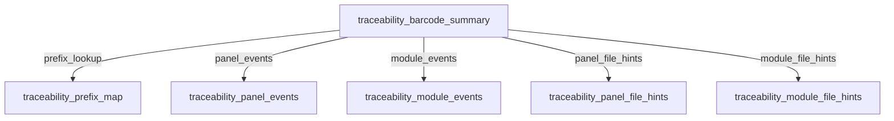

<!-- AUTO-GENERATED: Run `python generate_demo.py` to refresh. -->
# Local Route Chaining Demo

Generated on 2025-11-04T17:13:12.861975+00:00 UTC.

## Feature & Auth Toggles

These toggles were applied during the run and restored afterwards:

- **auth.mode**: "none" → "pseudo"
- **feature_flags.overrides_enabled**: false → true

## Command Transcript

### 1. Compile routes

**Command**

```python
compile_routes(SRC_DIR, BUILD_DIR)
```

**Response JSON**

```json
{
  "compiled_route_ids": [
    "traceability_barcode_summary",
    "traceability_module_events",
    "traceability_module_file_hints",
    "traceability_panel_events",
    "traceability_panel_file_hints",
    "traceability_prefix_map"
  ]
}
```

### 2. Prefix mapping lookup

**Command**

```python
runner.run(route_id="traceability_prefix_map", params={"prefix": "PN"}, format="records")
```

**Response JSON**

```json
{
  "rows": [
    {
      "file_hint_route": "traceability_module_file_hints",
      "prefix": "PN",
      "table_route": "traceability_module_events"
    },
    {
      "file_hint_route": "traceability_panel_file_hints",
      "prefix": "PN",
      "table_route": "traceability_panel_events"
    }
  ]
}
```

**Notes**

- used_cache: True
- cache_hit: False
- total_rows: 2
- applied_offset: 0
- applied_limit: None
- call_sequence: [
  {
    "route_id": "traceability_prefix_map",
    "used_cache": true,
    "cache_hit": false,
    "total_rows": 2,
    "applied_offset": 0,
    "applied_limit": null
  }
]

**Dependency Diagram**


### 3. Panel events lookup

**Command**

```python
runner.run(route_id="traceability_panel_events", params={"barcode": "PN-1001"}, format="records")
```

**Response JSON**

```json
{
  "rows": [
    {
      "barcode": "PN-1001",
      "event_time": "2025-01-15T08:30:00",
      "source_route": "traceability_panel_events",
      "station": "Laser Mark",
      "status": "Serial engraved",
      "work_center": "Line A"
    },
    {
      "barcode": "PN-1001",
      "event_time": "2025-01-15T09:00:00",
      "source_route": "traceability_panel_events",
      "station": "AOI",
      "status": "Inspection passed",
      "work_center": "Line A"
    },
    {
      "barcode": "PN-1001",
      "event_time": "2025-01-15T11:20:00",
      "source_route": "traceability_panel_events",
      "station": "Wave Solder",
      "status": "Solder joints complete",
      "work_center": "Line A"
    }
  ]
}
```

**Notes**

- used_cache: True
- cache_hit: False
- total_rows: 3
- applied_offset: 0
- applied_limit: None
- call_sequence: [
  {
    "route_id": "traceability_panel_events",
    "used_cache": true,
    "cache_hit": false,
    "total_rows": 3,
    "applied_offset": 0,
    "applied_limit": null
  }
]

**Dependency Diagram**


### 4. Traceability summary first execution

**Command**

```python
runner.run(route_id="traceability_barcode_summary", params={"barcode": "PN-1001"}, format="records")
```

**Response JSON**

```json
{
  "rows": [
    {
      "barcode": "PN-1001",
      "barcode_prefix": "PN",
      "event_time": "2025-01-15T08:30:00",
      "file_hint": "/lake/panels/2025/PN-1001.parquet",
      "file_hint_route": "traceability_panel_file_hints",
      "station": "Laser Mark",
      "status": "Serial engraved",
      "table_route": "traceability_panel_events",
      "work_center": "Line A"
    },
    {
      "barcode": "PN-1001",
      "barcode_prefix": "PN",
      "event_time": "2025-01-15T09:00:00",
      "file_hint": "/lake/panels/2025/PN-1001.parquet",
      "file_hint_route": "traceability_panel_file_hints",
      "station": "AOI",
      "status": "Inspection passed",
      "table_route": "traceability_panel_events",
      "work_center": "Line A"
    },
    {
      "barcode": "PN-1001",
      "barcode_prefix": "PN",
      "event_time": "2025-01-15T11:20:00",
      "file_hint": "/lake/panels/2025/PN-1001.parquet",
      "file_hint_route": "traceability_panel_file_hints",
      "station": "Wave Solder",
      "status": "Solder joints complete",
      "table_route": "traceability_panel_events",
      "work_center": "Line A"
    },
    {
      "barcode": "PN-1001-M1",
      "barcode_prefix": "PN",
      "event_time": "2025-01-15T12:05:00",
      "file_hint": "/lake/modules/2025/PN-1001-modules.parquet",
      "file_hint_route": "traceability_module_file_hints",
      "station": "Module Assembly",
      "status": "Module M1 married to panel",
      "table_route": "traceability_module_events",
      "work_center": "Cell 3"
    },
    {
      "barcode": "PN-1001-M2",
      "barcode_prefix": "PN",
      "event_time": "2025-01-15T12:20:00",
      "file_hint": "/lake/modules/2025/PN-1001-modules.parquet",
      "file_hint_route": "traceability_module_file_hints",
      "station": "Module Assembly",
      "status": "Module M2 married to panel",
      "table_route": "traceability_module_events",
      "work_center": "Cell 3"
    }
  ]
}
```

**Notes**

- used_cache: True
- cache_hit: False
- total_rows: 5
- applied_offset: 0
- applied_limit: None
- call_sequence: [
  {
    "route_id": "traceability_prefix_map",
    "used_cache": true,
    "cache_hit": true,
    "total_rows": 2,
    "applied_offset": 0,
    "applied_limit": null
  },
  {
    "route_id": "traceability_panel_events",
    "used_cache": true,
    "cache_hit": true,
    "total_rows": 3,
    "applied_offset": 0,
    "applied_limit": null
  },
  {
    "route_id": "traceability_module_events",
    "used_cache": true,
    "cache_hit": false,
    "total_rows": 2,
    "applied_offset": 0,
    "applied_limit": null
  },
  {
    "route_id": "traceability_panel_file_hints",
    "used_cache": true,
    "cache_hit": false,
    "total_rows": 1,
    "applied_offset": 0,
    "applied_limit": null
  },
  {
    "route_id": "traceability_module_file_hints",
    "used_cache": true,
    "cache_hit": false,
    "total_rows": 1,
    "applied_offset": 0,
    "applied_limit": null
  },
  {
    "route_id": "traceability_barcode_summary",
    "used_cache": true,
    "cache_hit": false,
    "total_rows": 5,
    "applied_offset": 0,
    "applied_limit": null
  }
]
- dependencies: [
  {
    "parent": "traceability_barcode_summary",
    "alias": "prefix_lookup",
    "target": "traceability_prefix_map"
  },
  {
    "parent": "traceability_barcode_summary",
    "alias": "panel_events",
    "target": "traceability_panel_events"
  },
  {
    "parent": "traceability_barcode_summary",
    "alias": "module_events",
    "target": "traceability_module_events"
  },
  {
    "parent": "traceability_barcode_summary",
    "alias": "panel_file_hints",
    "target": "traceability_panel_file_hints"
  },
  {
    "parent": "traceability_barcode_summary",
    "alias": "module_file_hints",
    "target": "traceability_module_file_hints"
  }
]

**Dependency Diagram**



### 5. Traceability summary cached execution

**Command**

```python
runner.run(route_id="traceability_barcode_summary", params={"barcode": "PN-1001"}, format="records")
```

**Response JSON**

```json
{
  "rows": [
    {
      "barcode": "PN-1001",
      "barcode_prefix": "PN",
      "event_time": "2025-01-15T08:30:00",
      "file_hint": "/lake/panels/2025/PN-1001.parquet",
      "file_hint_route": "traceability_panel_file_hints",
      "station": "Laser Mark",
      "status": "Serial engraved",
      "table_route": "traceability_panel_events",
      "work_center": "Line A"
    },
    {
      "barcode": "PN-1001",
      "barcode_prefix": "PN",
      "event_time": "2025-01-15T09:00:00",
      "file_hint": "/lake/panels/2025/PN-1001.parquet",
      "file_hint_route": "traceability_panel_file_hints",
      "station": "AOI",
      "status": "Inspection passed",
      "table_route": "traceability_panel_events",
      "work_center": "Line A"
    },
    {
      "barcode": "PN-1001",
      "barcode_prefix": "PN",
      "event_time": "2025-01-15T11:20:00",
      "file_hint": "/lake/panels/2025/PN-1001.parquet",
      "file_hint_route": "traceability_panel_file_hints",
      "station": "Wave Solder",
      "status": "Solder joints complete",
      "table_route": "traceability_panel_events",
      "work_center": "Line A"
    },
    {
      "barcode": "PN-1001-M1",
      "barcode_prefix": "PN",
      "event_time": "2025-01-15T12:05:00",
      "file_hint": "/lake/modules/2025/PN-1001-modules.parquet",
      "file_hint_route": "traceability_module_file_hints",
      "station": "Module Assembly",
      "status": "Module M1 married to panel",
      "table_route": "traceability_module_events",
      "work_center": "Cell 3"
    },
    {
      "barcode": "PN-1001-M2",
      "barcode_prefix": "PN",
      "event_time": "2025-01-15T12:20:00",
      "file_hint": "/lake/modules/2025/PN-1001-modules.parquet",
      "file_hint_route": "traceability_module_file_hints",
      "station": "Module Assembly",
      "status": "Module M2 married to panel",
      "table_route": "traceability_module_events",
      "work_center": "Cell 3"
    }
  ]
}
```

**Notes**

- used_cache: True
- cache_hit: True
- total_rows: 5
- applied_offset: 0
- applied_limit: None
- call_sequence: [
  {
    "route_id": "traceability_barcode_summary",
    "used_cache": true,
    "cache_hit": true,
    "total_rows": 5,
    "applied_offset": 0,
    "applied_limit": null
  }
]

**Dependency Diagram**


### 6. Traceability summary for module barcode

**Command**

```python
runner.run(route_id="traceability_barcode_summary", params={"barcode": "MD-5005"}, format="records")
```

**Response JSON**

```json
{
  "rows": [
    {
      "barcode": "MD-5005",
      "barcode_prefix": "MD",
      "event_time": "2025-01-14T18:15:00",
      "file_hint": "/lake/modules/2025/MD-5005.parquet",
      "file_hint_route": "traceability_module_file_hints",
      "station": "Module Test",
      "status": "Functional test passed",
      "table_route": "traceability_module_events",
      "work_center": "Test Lab"
    }
  ]
}
```

**Notes**

- used_cache: True
- cache_hit: False
- total_rows: 1
- applied_offset: 0
- applied_limit: None
- call_sequence: [
  {
    "route_id": "traceability_prefix_map",
    "used_cache": true,
    "cache_hit": false,
    "total_rows": 1,
    "applied_offset": 0,
    "applied_limit": null
  },
  {
    "route_id": "traceability_panel_events",
    "used_cache": true,
    "cache_hit": false,
    "total_rows": 0,
    "applied_offset": 0,
    "applied_limit": null
  },
  {
    "route_id": "traceability_module_events",
    "used_cache": true,
    "cache_hit": false,
    "total_rows": 1,
    "applied_offset": 0,
    "applied_limit": null
  },
  {
    "route_id": "traceability_panel_file_hints",
    "used_cache": true,
    "cache_hit": false,
    "total_rows": 0,
    "applied_offset": 0,
    "applied_limit": null
  },
  {
    "route_id": "traceability_module_file_hints",
    "used_cache": true,
    "cache_hit": false,
    "total_rows": 1,
    "applied_offset": 0,
    "applied_limit": null
  },
  {
    "route_id": "traceability_barcode_summary",
    "used_cache": true,
    "cache_hit": false,
    "total_rows": 1,
    "applied_offset": 0,
    "applied_limit": null
  }
]
- dependencies: [
  {
    "parent": "traceability_barcode_summary",
    "alias": "prefix_lookup",
    "target": "traceability_prefix_map"
  },
  {
    "parent": "traceability_barcode_summary",
    "alias": "panel_events",
    "target": "traceability_panel_events"
  },
  {
    "parent": "traceability_barcode_summary",
    "alias": "module_events",
    "target": "traceability_module_events"
  },
  {
    "parent": "traceability_barcode_summary",
    "alias": "panel_file_hints",
    "target": "traceability_panel_file_hints"
  },
  {
    "parent": "traceability_barcode_summary",
    "alias": "module_file_hints",
    "target": "traceability_module_file_hints"
  }
]

**Dependency Diagram**


### 7. run_route summary baseline

**Command**

```python
run_route("traceability_barcode_summary", {"barcode": "PN-1001"}, routes=routes, config=config, format="records")
```

**Response JSON**

```json
{
  "rows": [
    {
      "barcode": "PN-1001",
      "barcode_prefix": "PN",
      "event_time": "2025-01-15T08:30:00",
      "file_hint": "/lake/panels/2025/PN-1001.parquet",
      "file_hint_route": "traceability_panel_file_hints",
      "station": "Laser Mark",
      "status": "Serial engraved",
      "table_route": "traceability_panel_events",
      "work_center": "Line A"
    },
    {
      "barcode": "PN-1001",
      "barcode_prefix": "PN",
      "event_time": "2025-01-15T09:00:00",
      "file_hint": "/lake/panels/2025/PN-1001.parquet",
      "file_hint_route": "traceability_panel_file_hints",
      "station": "AOI",
      "status": "Inspection passed",
      "table_route": "traceability_panel_events",
      "work_center": "Line A"
    },
    {
      "barcode": "PN-1001",
      "barcode_prefix": "PN",
      "event_time": "2025-01-15T11:20:00",
      "file_hint": "/lake/panels/2025/PN-1001.parquet",
      "file_hint_route": "traceability_panel_file_hints",
      "station": "Wave Solder",
      "status": "Solder joints complete",
      "table_route": "traceability_panel_events",
      "work_center": "Line A"
    },
    {
      "barcode": "PN-1001-M1",
      "barcode_prefix": "PN",
      "event_time": "2025-01-15T12:05:00",
      "file_hint": "/lake/modules/2025/PN-1001-modules.parquet",
      "file_hint_route": "traceability_module_file_hints",
      "station": "Module Assembly",
      "status": "Module M1 married to panel",
      "table_route": "traceability_module_events",
      "work_center": "Cell 3"
    },
    {
      "barcode": "PN-1001-M2",
      "barcode_prefix": "PN",
      "event_time": "2025-01-15T12:20:00",
      "file_hint": "/lake/modules/2025/PN-1001-modules.parquet",
      "file_hint_route": "traceability_module_file_hints",
      "station": "Module Assembly",
      "status": "Module M2 married to panel",
      "table_route": "traceability_module_events",
      "work_center": "Cell 3"
    }
  ]
}
```

### 8. HTTP /local/resolve

**Command**

```python
client.post("/local/resolve", json=http_payload)
```

**Request JSON**

```json
{
  "format": "json",
  "params": {
    "barcode": "PN-1001"
  },
  "record_analytics": true,
  "reference": "local:traceability_barcode_summary?column=table_route&column=event_time&column=status"
}
```

**Response JSON**

```json
{
  "charts": [],
  "columns": [
    "table_route",
    "event_time",
    "status"
  ],
  "description": "Resolve prefix-driven dependencies and merge traceability rows from nested local routes.",
  "elapsed_ms": 2.9,
  "limit": null,
  "offset": 0,
  "route_id": "traceability_barcode_summary",
  "row_count": 5,
  "rows": [
    {
      "event_time": "2025-01-15T08:30:00",
      "status": "Serial engraved",
      "table_route": "traceability_panel_events"
    },
    {
      "event_time": "2025-01-15T09:00:00",
      "status": "Inspection passed",
      "table_route": "traceability_panel_events"
    },
    {
      "event_time": "2025-01-15T11:20:00",
      "status": "Solder joints complete",
      "table_route": "traceability_panel_events"
    },
    {
      "event_time": "2025-01-15T12:05:00",
      "status": "Module M1 married to panel",
      "table_route": "traceability_module_events"
    },
    {
      "event_time": "2025-01-15T12:20:00",
      "status": "Module M2 married to panel",
      "table_route": "traceability_module_events"
    }
  ],
  "title": "Traceability summary",
  "total_rows": 5
}
```

**Notes**

- status_code: 200

### 9. HTTP /local/resolve error

**Command**

```python
client.post("/local/resolve", json={})
```

**Request JSON**

```json
{}
```

**Response JSON**

```json
{
  "detail": {
    "category": "ValidationError",
    "code": "missing_parameter",
    "hint": "Ensure the query string includes the documented parameter name.",
    "message": "reference is required"
  }
}
```

**Notes**

- status_code: 400

## Route Source Files

### traceability_barcode_summary

```toml
id = "traceability_barcode_summary"
path = "/demos/traceability/summary"
title = "Traceability summary"
description = "Resolve prefix-driven dependencies and merge traceability rows from nested local routes."
methods = ["GET"]
allowed_formats = ["json", "records", "arrow"]
default_format = "json"

[params]
[params.barcode]
type = "str"
required = true
description = "Barcode or prefix to investigate"

[params.prefix]
type = "str"
required = false
description = "Derived uppercase prefix inserted by the preprocessor"

[cache]
ttl_hours = 2
order_by = ["event_time", "table_route"]

[[preprocess]]
callable = "webbed_duck.demos.local_chaining_traceability:inject_prefix"

[[uses]]
alias = "prefix_lookup"
call = "traceability_prefix_map"
mode = "relation"

  [uses.args]
  prefix = "prefix"

[[uses]]
alias = "panel_events"
call = "traceability_panel_events"
mode = "relation"

  [uses.args]
  barcode = "barcode"

[[uses]]
alias = "module_events"
call = "traceability_module_events"
mode = "relation"

  [uses.args]
  barcode = "barcode"

[[uses]]
alias = "panel_file_hints"
call = "traceability_panel_file_hints"
mode = "relation"

  [uses.args]
  barcode = "barcode"

[[uses]]
alias = "module_file_hints"
call = "traceability_module_file_hints"
mode = "relation"

  [uses.args]
  barcode = "barcode"
```

```sql
WITH required_routes AS (
  SELECT
    prefix,
    table_route,
    file_hint_route
  FROM prefix_lookup
),
panel AS (
  SELECT
    'traceability_panel_events' AS table_route,
    barcode,
    event_time,
    station,
    status,
    work_center
  FROM panel_events
),
module AS (
  SELECT
    'traceability_module_events' AS table_route,
    barcode,
    event_time,
    station,
    status,
    work_center
  FROM module_events
),
all_events AS (
  SELECT * FROM panel
  UNION ALL
  SELECT * FROM module
),
file_hints AS (
  SELECT
    'traceability_panel_events' AS table_route,
    barcode_root,
    file_hint
  FROM panel_file_hints
  UNION ALL
  SELECT
    'traceability_module_events' AS table_route,
    barcode_root,
    file_hint
  FROM module_file_hints
),
combined AS (
  SELECT
    r.prefix AS barcode_prefix,
    r.table_route,
    r.file_hint_route,
    e.barcode,
    e.event_time,
    e.station,
    e.status,
    e.work_center,
    f.file_hint
  FROM required_routes AS r
  LEFT JOIN all_events AS e USING (table_route)
  LEFT JOIN file_hints AS f
    ON f.table_route = r.table_route
   AND f.barcode_root = REGEXP_EXTRACT(e.barcode, '^([^-]+-[^-]+)', 1)
)
SELECT
  barcode_prefix,
  table_route,
  file_hint_route,
  barcode,
  event_time,
  station,
  status,
  work_center,
  file_hint
FROM combined
WHERE barcode IS NOT NULL
ORDER BY event_time;
```

### traceability_module_events

```toml
id = "traceability_module_events"
path = "/demos/traceability/module-events"
title = "Module traceability events"
description = "Downstream module pairings that reference the parent panel barcode."
methods = ["GET"]

[params]
[params.barcode]
type = "str"
required = true
description = "Full barcode or prefix to search"

[cache]
ttl_hours = 6
order_by = ["event_time", "barcode"]

[overrides]
key_columns = ["barcode", "event_time"]
allowed = ["status"]
```

```sql
WITH events AS (
  SELECT *
  FROM (
    VALUES
      ('PN-1001-M1', TIMESTAMP '2025-01-15 12:05:00', 'Module Assembly', 'Module M1 married to panel', 'Cell 3'),
      ('PN-1001-M2', TIMESTAMP '2025-01-15 12:20:00', 'Module Assembly', 'Module M2 married to panel', 'Cell 3'),
      ('MD-5005', TIMESTAMP '2025-01-14 18:15:00', 'Module Test', 'Functional test passed', 'Test Lab')
  ) AS t(barcode, event_time, station, status, work_center)
)
SELECT
  barcode,
  event_time,
  station,
  status,
  work_center,
  'traceability_module_events' AS source_route
FROM events
WHERE barcode = $barcode OR barcode LIKE $barcode || '%'
ORDER BY event_time;
```

### traceability_module_file_hints

```toml
id = "traceability_module_file_hints"
path = "/demos/traceability/module-files"
title = "Module parquet locations"
description = "Recommend parquet files that contain module-level traceability snapshots."
methods = ["GET"]

[params]
[params.barcode]
type = "str"
required = true
description = "Full barcode or prefix to search"

[cache]
ttl_hours = 12
order_by = ["file_hint"]

[overrides]
key_columns = ["barcode_root", "file_hint"]
allowed = []
```

```sql
WITH hints AS (
  SELECT *
  FROM (
    VALUES
      ('traceability_module_events', 'PN-1001', '/lake/modules/2025/PN-1001-modules.parquet'),
      ('traceability_module_events', 'MD-5005', '/lake/modules/2025/MD-5005.parquet')
  ) AS t(table_route, barcode_root, file_hint)
)
SELECT
  table_route,
  barcode_root,
  file_hint
FROM hints
WHERE barcode_root = SPLIT_PART($barcode, '-', 1)
   OR $barcode LIKE barcode_root || '%'
ORDER BY file_hint;
```

### traceability_panel_events

```toml
id = "traceability_panel_events"
path = "/demos/traceability/panel-events"
title = "Panel assembly traceability"
description = "Station history for assembled panels."
methods = ["GET"]

[params]
[params.barcode]
type = "str"
required = true
description = "Full barcode or prefix to search"

[cache]
ttl_hours = 6
order_by = ["event_time", "barcode"]

[overrides]
key_columns = ["barcode", "event_time"]
allowed = ["status"]
```

```sql
WITH events AS (
  SELECT *
  FROM (
    VALUES
      ('PN-1001', TIMESTAMP '2025-01-15 08:30:00', 'Laser Mark', 'Serial engraved', 'Line A'),
      ('PN-1001', TIMESTAMP '2025-01-15 09:00:00', 'AOI', 'Inspection passed', 'Line A'),
      ('PN-1001', TIMESTAMP '2025-01-15 11:20:00', 'Wave Solder', 'Solder joints complete', 'Line A'),
      ('PN-2007', TIMESTAMP '2025-01-16 07:45:00', 'Laser Mark', 'Serial engraved', 'Line B')
  ) AS t(barcode, event_time, station, status, work_center)
)
SELECT
  barcode,
  event_time,
  station,
  status,
  work_center,
  'traceability_panel_events' AS source_route
FROM events
WHERE barcode = $barcode OR barcode LIKE $barcode || '%'
ORDER BY event_time;
```

### traceability_panel_file_hints

```toml
id = "traceability_panel_file_hints"
path = "/demos/traceability/panel-files"
title = "Panel parquet locations"
description = "Recommend parquet files that contain panel-level traceability snapshots."
methods = ["GET"]

[params]
[params.barcode]
type = "str"
required = true
description = "Full barcode or prefix to search"

[cache]
ttl_hours = 12
order_by = ["file_hint"]

[overrides]
key_columns = ["barcode_root", "file_hint"]
allowed = []
```

```sql
WITH hints AS (
  SELECT *
  FROM (
    VALUES
      ('traceability_panel_events', 'PN-1001', '/lake/panels/2025/PN-1001.parquet'),
      ('traceability_panel_events', 'PN-2007', '/lake/panels/2025/PN-2007.parquet')
  ) AS t(table_route, barcode_root, file_hint)
)
SELECT
  table_route,
  barcode_root,
  file_hint
FROM hints
WHERE barcode_root = SPLIT_PART($barcode, '-', 1)
   OR $barcode LIKE barcode_root || '%'
ORDER BY file_hint;
```

### traceability_prefix_map

```toml
id = "traceability_prefix_map"
path = "/demos/traceability/prefix-map"
title = "Barcode prefix target routes"
description = "Map barcode prefixes to the traceability routes that should be queried."
methods = ["GET"]

[params]
[params.prefix]
type = "str"
required = true
description = "Uppercase barcode prefix (first segment before '-')"

[cache]
ttl_hours = 24
order_by = ["table_route"]

[overrides]
key_columns = ["prefix", "table_route"]
allowed = []
```

```sql
WITH mappings AS (
  SELECT *
  FROM (
    VALUES
      ('PN', 'traceability_panel_events', 'traceability_panel_file_hints'),
      ('PN', 'traceability_module_events', 'traceability_module_file_hints'),
      ('MD', 'traceability_module_events', 'traceability_module_file_hints'),
      ('BD', 'traceability_panel_events', 'traceability_panel_file_hints')
  ) AS t(prefix, event_route, file_hint_route)
)
SELECT
  prefix,
  event_route AS table_route,
  file_hint_route
FROM mappings
WHERE prefix = UPPER($prefix)
ORDER BY table_route;
```
